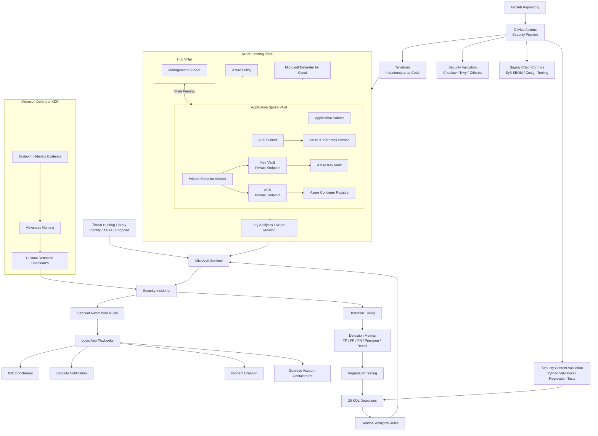

# Enterprise Cloud Security Platform Architecture

```mermaid
flowchart TB

    %% =====================================================
    %% SOURCE CONTROL / CI-CD
    %% =====================================================

    GitHub["GitHub Repository"]

    Actions["GitHub Actions<br/>Security Pipeline"]

    Terraform["Terraform<br/>Infrastructure as Code"]
    Scanning["Security Validation<br/>Checkov / Trivy / Gitleaks"]
    SupplyChain["Supply Chain Controls<br/>Syft SBOM / Cosign Tooling"]
    DetectionCI["Security Content Validation<br/>Python Validators / Regression Tests"]

    GitHub --> Actions

    Actions --> Terraform
    Actions --> Scanning
    Actions --> SupplyChain
    Actions --> DetectionCI


    %% =====================================================
    %% AZURE LANDING ZONE
    %% =====================================================

    subgraph Azure["Azure Landing Zone"]

        subgraph Hub["Hub VNet"]
            Management["Management Subnet"]
        end

        subgraph Spoke["Application Spoke VNet"]

            Application["Application Subnet"]

            AKSSubnet["AKS Subnet"]
            AKS["Azure Kubernetes Service"]

            PrivateSubnet["Private Endpoint Subnet"]

            KVPE["Key Vault<br/>Private Endpoint"]
            ACRPE["ACR<br/>Private Endpoint"]

            KeyVault["Azure Key Vault"]
            ACR["Azure Container Registry"]

        end

        Policy["Azure Policy"]
        Defender["Microsoft Defender for Cloud"]
        Monitor["Log Analytics / Azure Monitor"]

    end

    Terraform --> Azure

    Hub <-->|VNet Peering| Spoke

    AKSSubnet --> AKS

    PrivateSubnet --> KVPE
    PrivateSubnet --> ACRPE

    KVPE --> KeyVault
    ACRPE --> ACR

    Policy --> Azure
    Defender --> Azure
    Azure --> Monitor


    %% =====================================================
    %% SENTINEL / DETECTION ENGINEERING
    %% =====================================================

    Sentinel["Microsoft Sentinel"]

    Detection["20 KQL Detections"]
    Analytics["Sentinel Analytics Rules"]
    Incident["Security Incidents"]

    Hunting["Threat Hunting Library<br/>Identity / Azure / Endpoint"]

    Monitor --> Sentinel

    DetectionCI --> Detection
    Detection --> Analytics
    Analytics --> Sentinel
    Sentinel --> Incident

    Hunting --> Sentinel


    %% =====================================================
    %% SOAR / RESPONSE-AS-CODE
    %% =====================================================

    Automation["Sentinel Automation Rules"]
    LogicApps["Logic App Playbooks"]

    Enrich["IOC Enrichment"]
    Notify["Security Notification"]
    CreateIncident["Incident Creation"]
    Contain["Guarded Account Containment"]

    Incident --> Automation
    Automation --> LogicApps

    LogicApps --> Enrich
    LogicApps --> Notify
    LogicApps --> CreateIncident
    LogicApps --> Contain


    %% =====================================================
    %% DEFENDER XDR
    %% =====================================================

    subgraph XDR["Microsoft Defender XDR"]

        XDRHunt["Advanced Hunting"]
        XDRDetection["Custom Detection Candidates"]
        XDREvidence["Endpoint / Identity Evidence"]

    end

    XDREvidence --> XDRHunt
    XDRHunt --> XDRDetection

    XDRDetection --> Incident


    %% =====================================================
    %% CONTINUOUS IMPROVEMENT
    %% =====================================================

    Tuning["Detection Tuning"]
    Metrics["Detection Metrics<br/>TP / FP / FN / Precision / Recall"]
    Tests["Regression Testing"]

    Incident --> Tuning
    Tuning --> Metrics
    Metrics --> Tests
    Tests --> Detection
```